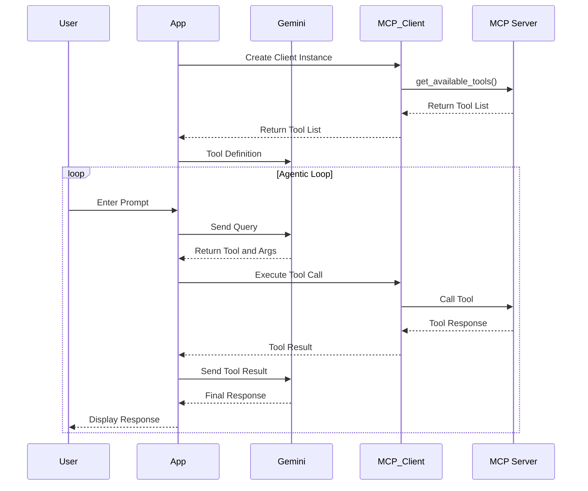
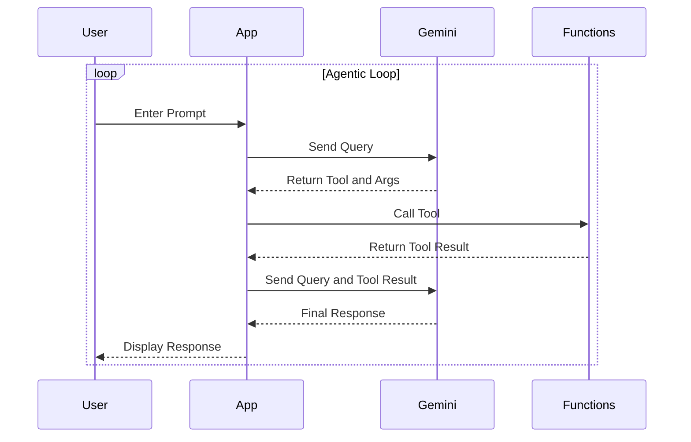

# MCP Samples
## Overview
The Model Context Protocol (MCP) is an open standard that streamlines the integration of AI assistants with external data sources, tools, and systems. [MCP standardizes how applications provide context to LLMs](https://modelcontextprotocol.io/introduction). MCP establishes the essential standardized interface allowing AI models to connect directly with diverse external systems and services.

Developers have the option to use third-party MCP servers or create custom ones when building applications.

The below shows the comparison between MCP workflow vs native tool call.

## MCP Sequence Diagram



## Traditional tool calling



## Folder
```dotnetcli
├── create_mcp_server_by_gemini.ipynb
├── intro_to_MCP_with_vertexai.ipynb
├── README.md
├── server
├── adk_mcp_app
```

## Notebooks
1. `intro_to_MCP_with_vertexai.ipynb` shows two ways to use MCP with Vertex AI
 - Build a custom MCP server, and use it with Gemini on Vertex AI
 - Use pre-built MCP server with Vertex AI

2. `create_mcp_server_by_gemini.ipynb` shows how to use Gemini 2.5 Pro to create a custom MCP server
3. `adk_mcp_app` contains a FastAPI based app which uses ADK agent with MCP client.
