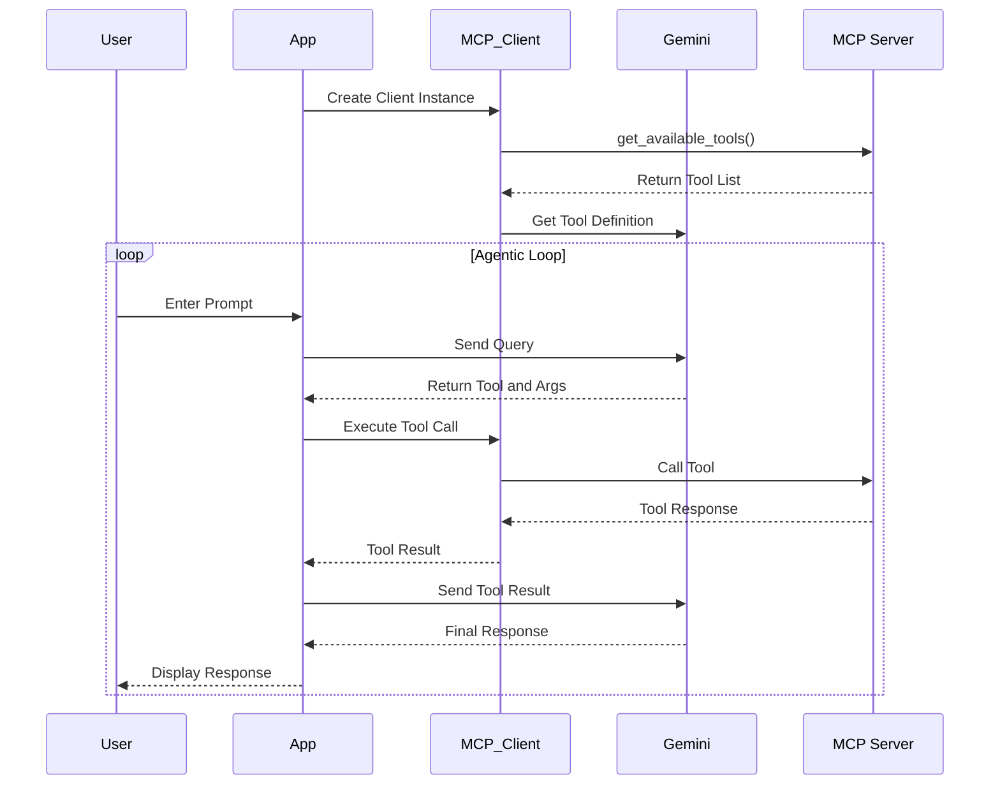
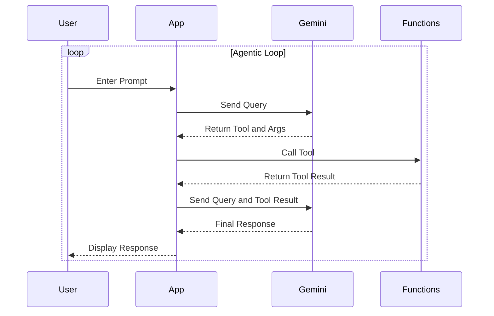

# Overview
TODO: to be updated.

The below shows the comparison between MCP tool call vs Vanilla tool call.

## MCP tool call

```mermaid
%%{
  init: {
    'theme': 'default', 
    'themeVariables': {
        'fontSize':'18px',
        'fontFamily':'arial',
    }
  }
}%%

sequenceDiagram
    participant User
    participant App
    participant MCP_Client
    participant Gemini
    participant MCP Server

    App->>MCP_Client: Create Client Instance
    MCP_Client->>MCP Server: get_available_tools()
    MCP Server-->>MCP_Client: Return Tool List
    MCP_Client->>Gemini: Get Tool Definition
    
    loop Agentic Loop
        User->>App: Enter Prompt
        App->>Gemini: Send Query
        
 
        Gemini-->>App: Return Tool and Args
        App->>MCP_Client: Execute Tool Call
        MCP_Client->>MCP Server: Call Tool
        MCP Server-->>MCP_Client: Tool Response
        MCP_Client-->>App: Tool Result
        App->>Gemini: Send Tool Result
        Gemini-->>App: Final Response
     
        
        App-->>User: Display Response
    end
```

## Vanilla tool call

```mermaid
%%{
  init: {
    'theme': 'default', 
    'themeVariables': {
        'fontSize':'18px',
        'fontFamily':'arial',
    }
  }
}%%

sequenceDiagram
    participant User
    participant App
    participant Gemini
    participant Functions

  

  
    
    loop Agentic Loop
        User->>App: Enter Prompt
        App->>Gemini: Send Query
        
        
        Gemini-->>App: Return Tool and Args
        
        App->>Functions: Call Tool
        Functions-->>App: Return Tool Result
        App->>Gemini: Send Query and Tool Result
        Gemini-->>App: Final Response
      
        App-->>User: Display Response
    end
```