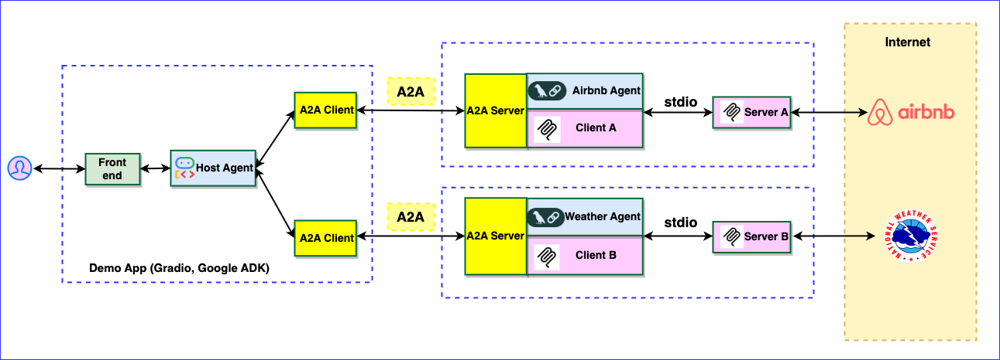

# Build Agents using A2A SDK (Prototype)
----
> *⚠️ DISCLAIMER: THIS IS A PERSONAL PROJECT. THIS PROJECT IS INTENDED FOR DEMONSTRATION PURPOSES ONLY. IT IS NOT INTENDED FOR USE IN A PRODUCTION ENVIRONMENT.* 
----

This document describes a web application demonstrating the integration of Google's Agent to Agent (A2A), Agent Development Kit (ADK) for multi-agent orchestration with Model Context Protocol (MCP) clients. The application features a host agent coordinating tasks between remote agents that interact with various MCP servers to fulfill user requests.

### Architecture

The application utilizes a multi-agent architecture where a host agent delegates tasks to remote agents (Airbnb and Weather) based on the user's query. These agents then interact with corresponding MCP servers.




## Setup and Deployment

### Prerequisites

Before running the application locally, ensure you have the following installed:

1. **Node.js:** Required to run the Airbnb MCP server (if testing its functionality locally).
2. **(Optional) uv:** The Python package management tool used in this project. Follow the installation guide: [https://docs.astral.sh/uv/getting-started/installation/](https://docs.astral.sh/uv/getting-started/installation/)
3. **set up .env**  

- create .env file in `examples/airbnb_agent` and `examples/weater_agent`folder with the following content
GOOGLE_API_KEY="your_api_key_here" 

- create .env file in `examples/host_agent/adk_agent`folder with the following content:
GOOGLE_GENAI_USE_VERTEXAI=TRUE
GOOGLE_CLOUD_PROJECT="your project"
GOOGLE_CLOUD_LOCATION=us-central1
AIR_AGENT_URL=http://localhost:10002
WEA_AGENT_URL=http://localhost:10001

## Install SDK
Go to `a2a-python-sdk-0515` folder in terminal:
```bash
python -m venv .venv
source .venv/bin/activate
pip install -e .[dev]
```

## Verify install

```py
import a2a
```

## 1. Run Airbnb server

Run Remote server

```bash
cd examples/airbnb_agent
pip install -e .[dev]
python __main__.py
```

## 2. Run Weather server
Open a new terminal, go to `a2a-python-sdk-0515` folder run the server

```bash
source .venv/bin/activate
cd examples/weather_agent
pip install -e .[dev]
python __main__.py
```

## 3. Run Host Agent
Open a new terminal, go to `a2a-python-sdk-0515` folder run the server

```bash
source .venv/bin/activate
cd examples/host_agent
pip install -e .[dev]
python routing_agent_demo.py
```

## 4. Test at the UI

Here're example questions:

"Tell me about weather in LA, CA"
"Please find a bedroom in LA, CA, June 20-25, 2025"

## References
- https://github.com/google/a2a-python
- https://codelabs.developers.google.com/intro-a2a-purchasing-concierge#1
- https://github.com/alphinside/purchasing-concierge-intro-a2a-codelab-starter
- https://google.github.io/adk-docs/
## License

This project is licensed under the terms of the [Apache 2.0 License](LICENSE).
