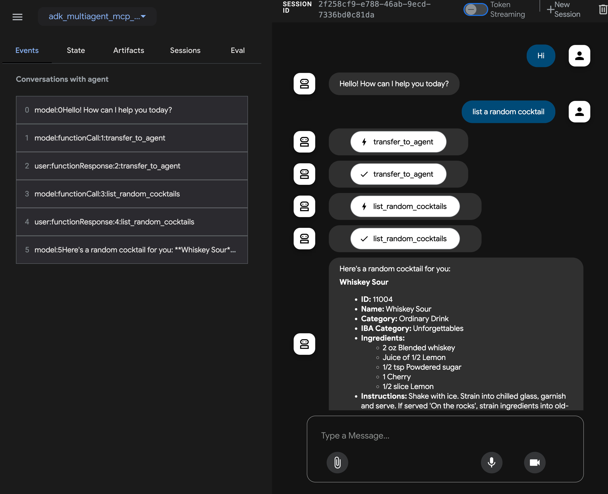

# ADK Multi-Agent MCP Client Application

## Overview

This document describes a web application demonstrating the integration of Google's Agent Development Kit (ADK) for multi-agent orchestration with Model Context Protocol (MCP) clients. The application features a root agent coordinating tasks between specialized agents that interact with various MCP servers to fulfill user requests.

### Architecture

The application utilizes a multi-agent architecture where a root agent delegates tasks to specialized agents (Cocktail and Booking) based on the user's query. These agents then interact with corresponding MCP servers.


### Application Screenshot



## Core Components

### Agents

The application employs three distinct agents:

- **Root Agent:** The main entry point that receives user queries, determines the required task(s), and delegates to the appropriate specialized agent(s).
- **Cocktail Agent:** Handles requests related to cocktail recipes and ingredients by interacting with the Cocktail MCP server.
- **Booking Agent:** Manages requests related to weather forecasts and Airbnb bookings by interacting with the Weather and Airbnb MCP servers.

### MCP Servers and Tools

The agents interact with the following MCP servers:

1. **Cocktail MCP Server** (Local Code)
   - Provides 5 tools:
     - `search cocktail by name`
     - `list all cocktail by first letter`
     - `search ingredient by name`
     - `list random cocktails`
     - `lookup full cocktail details by id`
2. **Weather MCP Server** (Local Code)
   - Provides 3 tools:
     - `get weather forecast by city name`
     - `get weather forecast by coordinates`
     - `get weather alert by state code`
3. **Airbnb MCP Server** ([Public GitHub repository](https://github.com/openbnb-org/mcp-server-Airbnb) - Requires separate setup)
   - Provides 2 tools:
     - `search for Airbnb listings`
     - `get detailed information about a specific Airbnb listing`

## Example Usage

Here are some example questions you can ask the chatbot:

- `Please get cocktail margarita id and then full detail of cocktail margarita`
- `Please list a random cocktail`
- `Please get weather forecast for New York`
- `Please get weather forecast for 40.7128,-74.0060`
- `I would like to know information about an Airbnb condo in LA, CA for 2 nights. 04/28 - 04/30, 2025, two adults, no kid`

## Setup and Deployment

### Prerequisites

Before running the application locally, ensure you have the following installed:

1. **Node.js:** Required to run the Airbnb MCP server (if testing its functionality locally).
2. **uv:** The Python package management tool used in this project. Follow the installation guide: [https://docs.astral.sh/uv/getting-started/installation/](https://docs.astral.sh/uv/getting-started/installation/)


## **1. Project Structure**

Ensure your project follows this structure:

```bash
Your_project_folder/
└── adk_multiagent_mcp_app/  # App folder
│   ├── agent.py
│   ├── __init__.py
│   ├── mcp_server
│       ├── cocktail.py
│       └── weather_server.py
├── asset
│   ├── adk_multiagent.png
│   └── screenshot.png
├── pyproject.toml
├── .env
├── README.md
└── uv.lock

```

## **2. Configure Environment Variables**

Create a `.env` file in the `adk_multiagent_mcp_app` directory with the following content. Replace placeholders with your actual values.

```dotenv
# Choose Model Backend: 0 -> ML Dev, 1 -> Vertex AI
GOOGLE_GENAI_USE_VERTEXAI=1

# --- ML Dev Backend Configuration (if GOOGLE_GENAI_USE_VERTEXAI=0) ---
# Obtain your API key from Google AI Studio or Google Cloud console
GOOGLE_API_KEY=YOUR_GOOGLE_API_KEY

# --- Vertex AI Backend Configuration (if GOOGLE_GENAI_USE_VERTEXAI=1) ---
# Your Google Cloud Project ID
GOOGLE_CLOUD_PROJECT="your-project-id"
# The location (region) for Vertex AI services
GOOGLE_CLOUD_LOCATION="us-central1"
```

## **3. Start the Application Locally**

Navigate to the adk-web-ui directory in your terminal and run the application:

```bash
adk web
```

