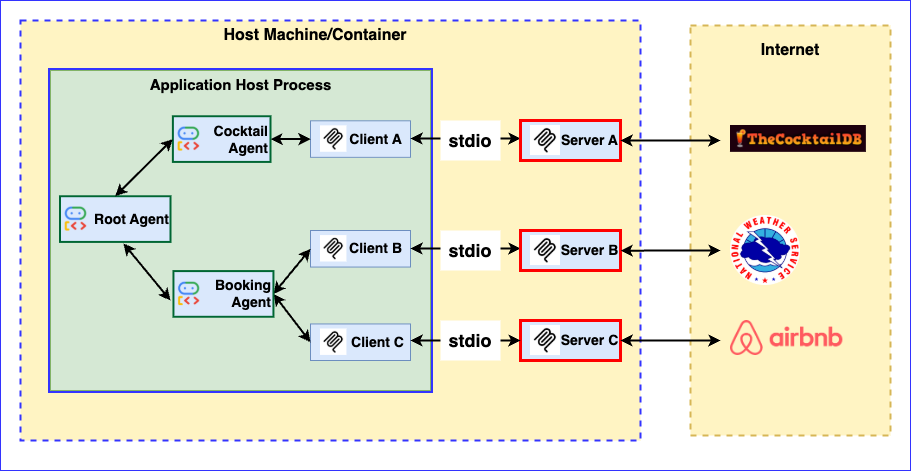
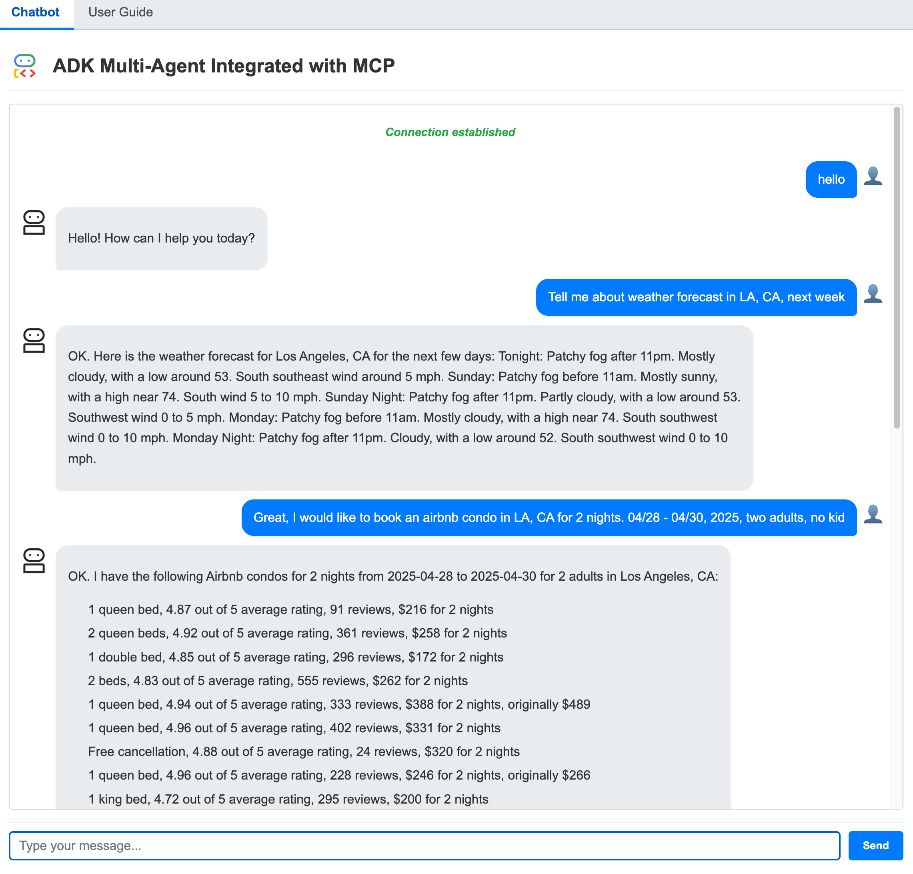

## An ADK Agent integrated with MCP Client

This web application was developed using Google's ADK (Agent Development Kit) and MCP (Model Context Protocol). Specifically, the Agent relies on the Google ADK to interact with the MCP server.

This chatbot demonstrates the use of the ADK Multi-Agent integrated with MCP Clients

Architecture:

  


Screenshot:




It has three agents: root agent, cocktail agent, and booking agent. 

  
It interacts with the following MCP servers:  
          - 1. Cocktail MCP server (Local code)
          - 2. Weather MCP server  (Local code)
          - 3. [Public AirBnB MCP server](https://github.com/openbnb-org/mcp-server-airbnb) (Fetch code via Pypi)
          
The Cocktail MCP server has 5 tools:  
          - 1. search cocktail by name  
          - 2. list all cocktail by first letter   
          - 3. search ingredient by name.   
          - 4. list random cocktails   
          - 5. lookup full cocktail details by id  

The Weather MCP server has 3 tools:  
          - 1. get weather forecast by city name
          - 2. get weather forecast by coordinates   
          - 3. get weather alert by state code  

The AirBnB MCP server has 2 tools:  
          - 1. search for Airbnb listings
          - 2. get detailed information about a specific Airbnb listing

**2. Example questions**  
Here are some example questions you can ask the chatbot:  
- 'Please get cocktail margarita id and then full detail of cocktail margarita' 
- 'Please list a random cocktail'
- 'Please get weather forecast for New York'
- 'Please get weather forecast for 40.7128,-74.0060'
- 'I would like to know information about an airbnb condo in LA, CA for 2 nights. 04/28 - 04/30, 2025, two adults, no kid'  


## Instructions
## 1. Test it locally
** Make sure you have Node.js installed to run the AirBnB MCP server locally**


### Create & Activate Virtual Environment (Recommended):

```
python -m venv .venv
source .venv/bin/activate
```

### Install ADK and dependencies:

```
pip install google-adk fastapi uvicorn geopy

```

Project Structure

```
your_project_folder/  # Project folder
|── adk_multiagent_mcp_app
   ├── adk_app.png
   ├── main.py
   ├── mcp_server
   │   ├── cocktail.py
   │   └── weather_server.py
   ├── README.md
   └── static
       ├── adk_multiagent.png
       ├── index.html
       ├── robot1.png
       └── user_guide.md
```

### Run the app

Start the Fast API: Run the following command within the `adk_mcp_app` folder

1. Set up values in `.env ` file

Create a .env file with the following contents:

```
# Choose Model Backend: 0 -> ML Dev, 1 -> Vertex
GOOGLE_GENAI_USE_VERTEXAI=1

# ML Dev backend config
GOOGLE_API_KEY=YOUR_VALUE_HERE

# Vertex backend config
GOOGLE_CLOUD_PROJECT="<your project id>"
GOOGLE_CLOUD_LOCATION="us-central1"
```

If using Google API key:

```
GOOGLE_GENAI_USE_VERTEXAI=0
GOOGLE_API_KEY=YOUR_VALUE_HERE
```

If using Vertex AI Project ID:

```
GOOGLE_GENAI_USE_VERTEXAI=1
GOOGLE_CLOUD_PROJECT=YOUR_VALUE_HERE
GOOGLE_CLOUD_LOCATION="us-central1"
```

2.  Run the below command

```
uvicorn main:app --reload
```

## 2. Build and Deploy the Application to Cloud Run


- Build and deploy the service to Cloud Run:

   In Cloud Shell, execute the following command to name the Cloud Run service:

   ```bash
   export SERVICE_NAME='adk-multiagent-mcp-app' # This is the name of our Application and Cloud Run service. Change it if you'd like.
   export LOCATION='us-central1'             # If you change this, make sure the region is supported.
   export PROJECT_ID='<your project id>'  # Change this
   ```

   In Cloud Shell, execute the following command:

   ```bash
   gcloud run deploy $SERVICE_NAME \
     --source . \
     --region $LOCATION \
     --project $PROJECT_ID \
     --memory 4G \
     --allow-unauthenticated 
   ```

On successful deployment, you will be provided a URL to the Cloud Run service. You can visit that in the browser to view the Cloud Run application that you just deployed. 